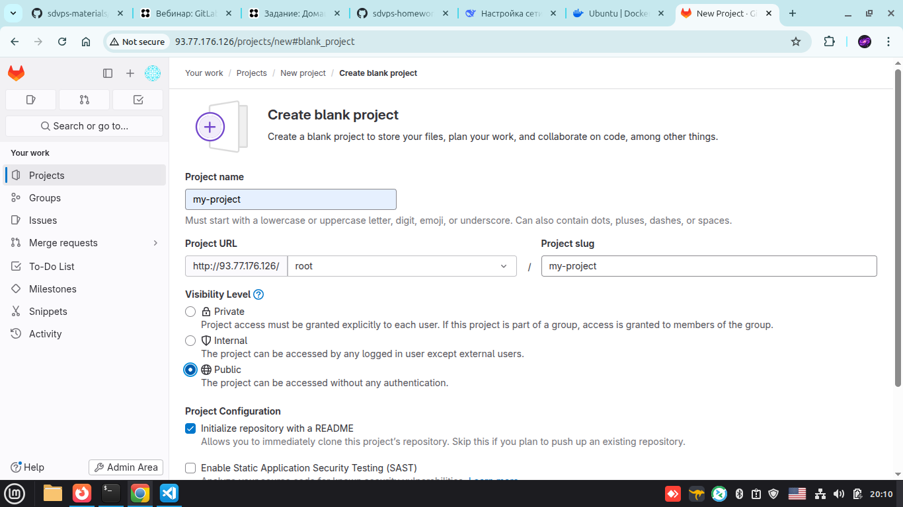
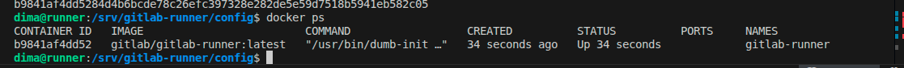
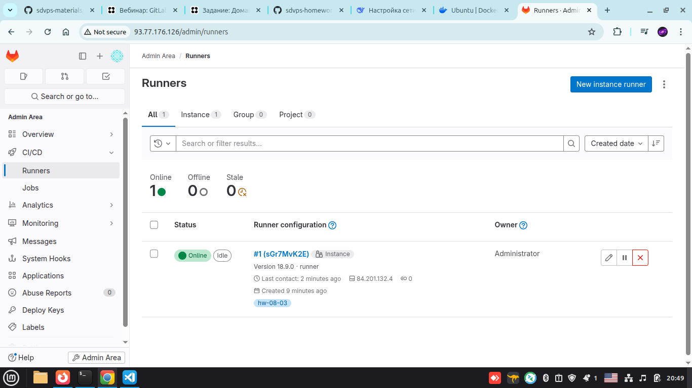
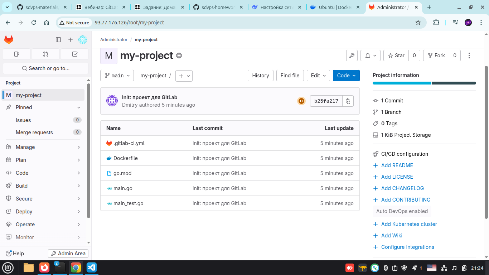
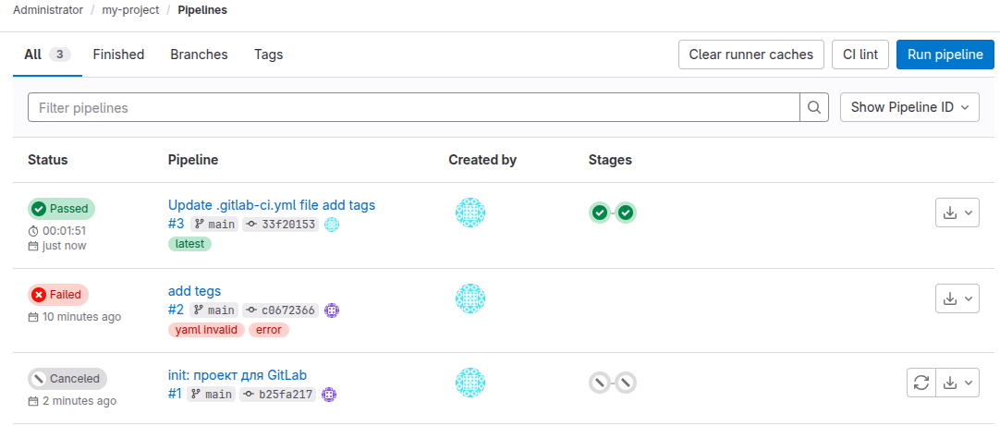

# Домашнее задание к занятию "GitLab" - Герасин Д.С.


  28.02.2026
  модуль CI/DI
  
---
## Структура выполненной работы

```bash 
├── ansible  # устанавливает докер на runner
│   ├── ansible.cfg
│   └── playbook.yml
├── bloknot.txt
├── img    # скриншоты в процессе выполнения
│   ├── 01gitlab-08-03.png
│   ├── 02hw-08-03.png
│   ├── 03hw08-03.png
│   ├── 04hw-08.03.png
│   └── 05hw-08-03.png
├── project  # пушим на gitlab простой путь скопировать в /tmp 
│   ├── Dockerfile
│   ├── go.mod
│   ├── main.go
│   └── main_test.go
├── README.md
└── terraform  # создает две машины в облаке
    ├── cloud-init.yml
    ├── key.json
    ├── network.tf
    ├── providers.tf
    ├── terraform.tfstate
    ├── terraform.tfstate.backup
    ├── variables.tf
    └── vm.tf

```


### Задание 1

**Что нужно сделать:**

1. Разверните GitLab локально, используя Vagrantfile и инструкцию, описанные в [этом репозитории](https://github.com/netology-code/sdvps-materials/tree/main/gitlab).
2. Создайте новый проект и пустой репозиторий в нём.
3. Зарегистрируйте gitlab-runner для этого проекта и запустите его в режиме Docker. Раннер можно регистрировать и запускать на той же виртуальной машине, на которой запущен GitLab.

В качестве ответа в репозиторий шаблона с решением добавьте скриншоты с настройками раннера в проекте.

---

1. Мы создали 2 машины с помощью [terraform](terraform/) и настроили  с помощью [ansible](ansible/) docker на ВМ c runner. Так как локально не хватает ресурсов. 
2. Создали новый проект на своем Gitlab сервере
3. Зарегистрировали gitlab-runner для этого проекта и запустили его в режиме Docker


### Скриншоты
#### 1. Зарегистрировали репозиторий на gitlab



#### 2. Запустили докер на runner



#### 3. Подключили runner к gitlab




---

### Задание 2

**Что нужно сделать:**

1. Запушьте [репозиторий](https://github.com/netology-code/sdvps-materials/tree/main/gitlab) на GitLab, изменив origin. Это изучалось на занятии по Git.
2. Создайте .gitlab-ci.yml, описав в нём все необходимые, на ваш взгляд, этапы.

В качестве ответа в шаблон с решением добавьте:

 * файл gitlab-ci.yml для своего проекта или вставьте код в соответствующее поле в шаблоне;
 * скриншоты с успешно собранными сборками.


---

1. Запушили репозиторий на GitLab, remote `/data/DevOps_Universe/Netology/CI-DI/8-03-hw/project`
2. Создали .gitlab-ci.yml

```yml
stages:
  - test
  - build

test:
  stage: test
  image: golang:1.17
  script: 
   - go test .
  tags:
    - hw-08-03
    
build:
  stage: build
  image: docker:latest
  script:
   - docker build .
  tags:
    - hw-08-03
    
```


### Скриншоты
#### 1. project




#### 2. Успешная сборка




---

